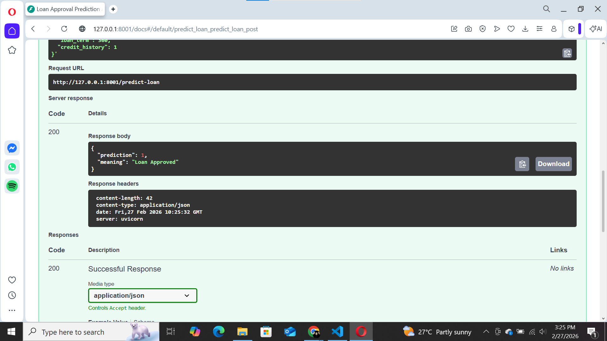

# Loan Approval Prediction API (FastAPI + Naive Bayes)

A simple Machine Learning API that predicts whether a loan will be approved or rejected using a trained Gaussian Naive Bayes model.  
The model is trained offline and served using FastAPI.

---

## Features Used

- ApplicantIncome
- CoapplicantIncome
- LoanAmount
- Loan_Amount_Term
- Credit_History

Target:
- Loan_Status (Y/N)

---

## How To Run

### 1. Install dependencies
pip install -r requirements.txt

### 2. Train the model
python src/train.py

### 3. Run the API
python -m uvicorn src.app:app --reload

Open in browser:
http://127.0.0.1:8000/docs

---

## Example Request (POST /predict-loan)

{
  "applicant_income": 5000,
  "coapplicant_income": 1500,
  "loan_amount": 120,
  "loan_term": 360,
  "credit_history": 1
}

---

## Example Response

{
  "prediction": 1,
  "meaning": "Loan Approved"
}

---

## API Preview

### Swagger Docs

### Sample Request

### Sample Response
